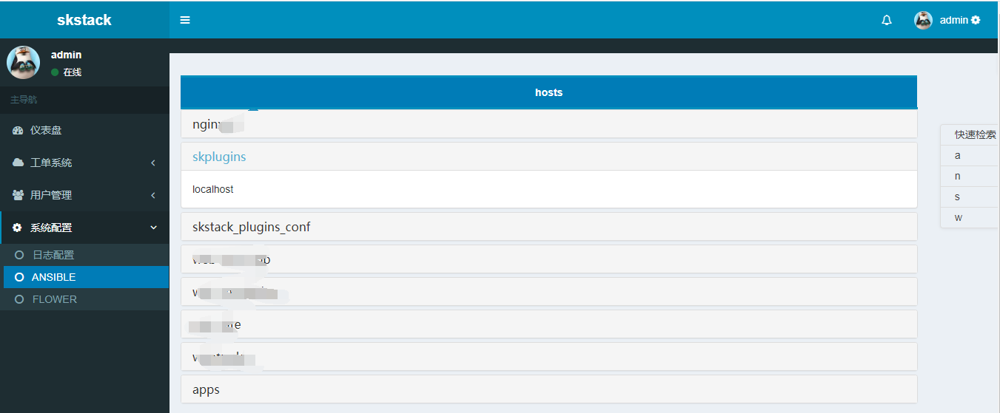

系统管理
===============

ansible hosts索引页
--------------------------------

配置文件：skstack_$evn.conf   配置参数如下：

.. code-block:: python

	[config]
	ansible_path = /etc/ansible/

   
.. note::
	  #. 该页面会显示skstack web系统所在服务器 ansible目录下 所有以hosts字符串命名的文件主机索引，如hosts、hosts-prod这种命名
	  #. 快速索引，便于快速跳转到以某个字母开头的ansible hosts group位置。
	  #. 展开ansible group折叠页面，可以看到改ansible hosts group下的主机清单

celery flower嵌套页
--------------------------------

配置：skstack_$evn.conf  配置参数如下：

.. code-block:: python

	[flower]
	flower_url = http://ip:5555/dashboard   

.. image:: _images/skconfig_flower.png
   :alt: image not found
   
.. note::
	  #. #flower初始启动地址和端口 详见skstack/start_celery.sh脚本 
	  #. 该url必须浏览器可以直接访问，skstack web通过嵌套页面访问flower
	  

