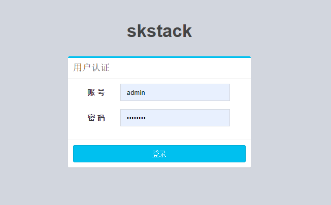

安装手册
===============

环境说明
----------------
* Python3.7.4
* Django2.2.5 
* system：windows or linux 
* Verified operating system：Centos7（suggested ）and  windlows 10

 

安装步骤
-------------

安装python虚拟机 
~~~~~~~~~~~~~~~~~~~~~~

 * 安装python 3.7和python虚拟机  略（为了不影响其他python应用环境强烈建议安装python虚拟机）；

 * 用virtualenvwrapper按照python虚拟环境
  #. mkvirtualenv skstack
  #. workon skstack

安装源码和依赖包
~~~~~~~~~~~~~~~~~~~~~~

请将服务器端安装在centos7上

 #. git clone $GitUrl/skstack.git
 #. yum install ansible -y
 #. yum install smartmontools -y
 #. yum install python python-devel -y
 #. cd skstack 进入到项目主目录
 #. workon skstack 切换到skstack的python虚拟环境
 #. pip install -r requirements.txt

配置文件修改
~~~~~~~~~~~~~~~~~~~~~~

 #. cd skstack
 #. 编辑skstack_prod.conf文件填写mysql数据库等信息
 #. 如果有skstack_dev.conf文件，会先读取，主要用于开发模式

建库和初始化数据
~~~~~~~~~~~~~~~~~~~~~~
安装数据库

 #. yum install -y mariadb-server mariadb-devel
 #. service mariadb start
 #. chkconfig mariadb on

创建建库和数据库用户

 #. mysql -uroot -p登录数据库
 #. CREATE DATABASE skstack DEFAULT CHARACTER SET utf8 COLLATE utf8_general_ci;  创建schema
 #. GRANT ALL PRIVILEGES ON skstack.* TO 'ser_skstack'@'localhost' IDENTIFIED BY 'Password59584'; 创建用户

 #. workon skstack 切换到python虚拟机环境

初始化数据：

 #. python manage.py makemigrations
 #. python manage.py migrate
 #. python manage.py createsuperuser  创建用户

运行web平台和登录
~~~~~~~~~~~~~~~~~~~~~~
python manage.py runserver 0.0.0.0:8000

登录页面

安装工单系统插件
~~~~~~~~~~~~~~~~~~~~~~
详见各插件安装使用说明文档

