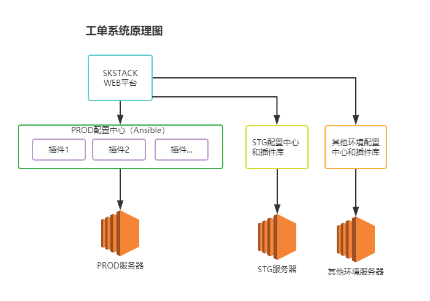
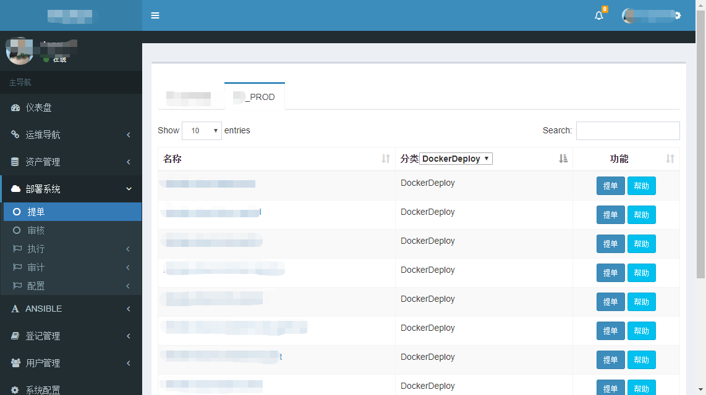
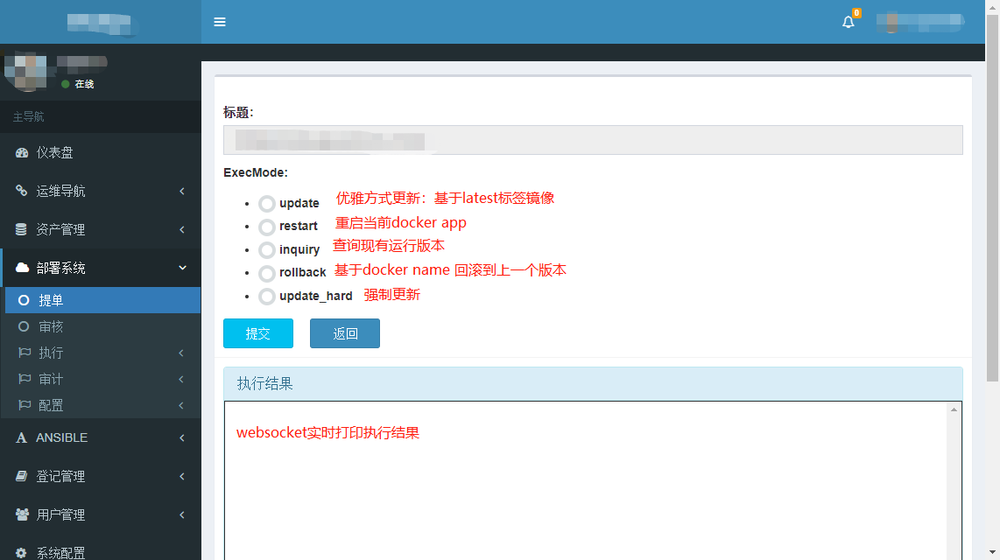
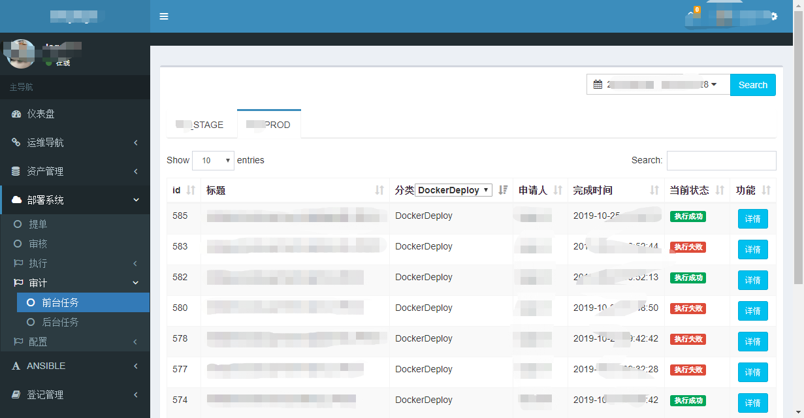
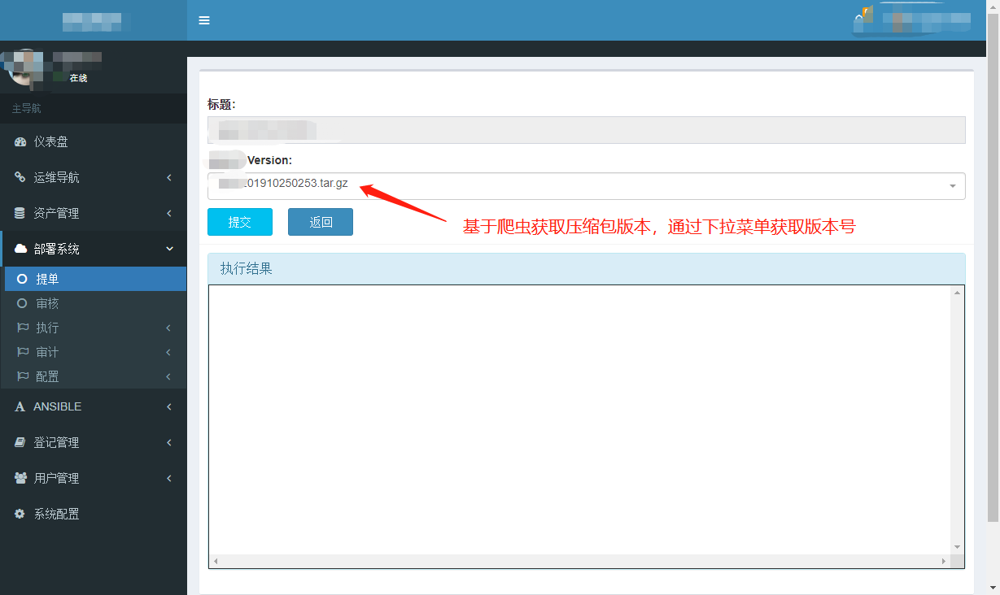

概述
===============

 #. 该项目目前处于内测阶段，暂未开源，请其他渠道获取代码的童鞋 暂未投入生产使用
 #. SKSTACK主要作为运维服务台，主要提供版本发布、自动化任务执行和统计相关功能
 #. 开发语言：python 3.7 + django2.2 

功能介绍
--------------------------------

::

	工单系统：
		提单：用户可选变量，自定义前端变量表单类型
		审核：多级审核，支持审核意见
		执行：websocket实时展示执行结果
		审计：查看历史执行情况、支持可选动态列展示
		配置：支持模板配置、支持内置变量、自定义变量、系统变量配置。支持pre main post多重任务配置
		插件：官方插件有docker项目发布、git项目发布、tar.gz压缩包项目发布等。支持自定义插件
		其他：支持任务锁避免重复执行、工单根据环境标签分类、支持手机和pad、多配置中心（如ansible）管理

 	仪表盘：
	 	激活工单分类统计
	 	激活用户和分组统计
	 	执行状态统计
	 	激活工单分环境统计
	 	
 	用户系统：
		用户管理
		菜单管理
		角色授权
		审核流程管理

工单系统架构图
--------------------------------

.. note::
	  #. 配置中心一般指的是批量配置管理服务器如Ansible服务器，skstack可以支持多个配置中心注册到平台
	  #. 插件一般安装在配置中心，调用配置配置中心进行远程服务器实例变更或查询操作
	  #. 插件也可以安装在目标服务器实例直接执行，需要将目标服务器以配置中心的方式注册到skstack平台
	  #. 工单注册时，由管理员关联配置中心。
..

工单系统主要工作原理图
--------------------------------

.. image:: _images/skstack_workflow.png
   :alt: image not found

.. note::
	  #. 前置任务未非必须项，若没有会跳过改执行步骤
	  #. 后置任务未非必须项，若没有会跳过改执行步骤
	  #. 只有变量注册为通过变量脚本获取的可选变量时才会执行变量获取脚本。没有则跳过该步骤
..

Demo
--------------------------------

Docker项目版本发布
~~~~~~~~~~~~~~~~~~~~~~

 * 基于公有云docker镜像仓库或者私有docker镜像仓库做版本仓库库管理；
 * 通过发布插件获取版本号；
 * 通过工单系统的docker项目发布插件进行版本发布

索引页面

   
发布页面

   
审计页面

gitlab项目版本发布
~~~~~~~~~~~~~~~~~~~~~~

 * 基于gitlab做版本仓库库管理；
 * 通过发布插件获取版本号；
 * 通过工单系统的gitlab项目发布插件进行版本发布

   
压缩包项目版本发布
~~~~~~~~~~~~~~~~~~~~~~

 * 基于nginx做压缩包版本仓库管理；
 * 通过爬虫获取版本号；
 * 通过工单系统的压缩包发布插件进行版本发布

