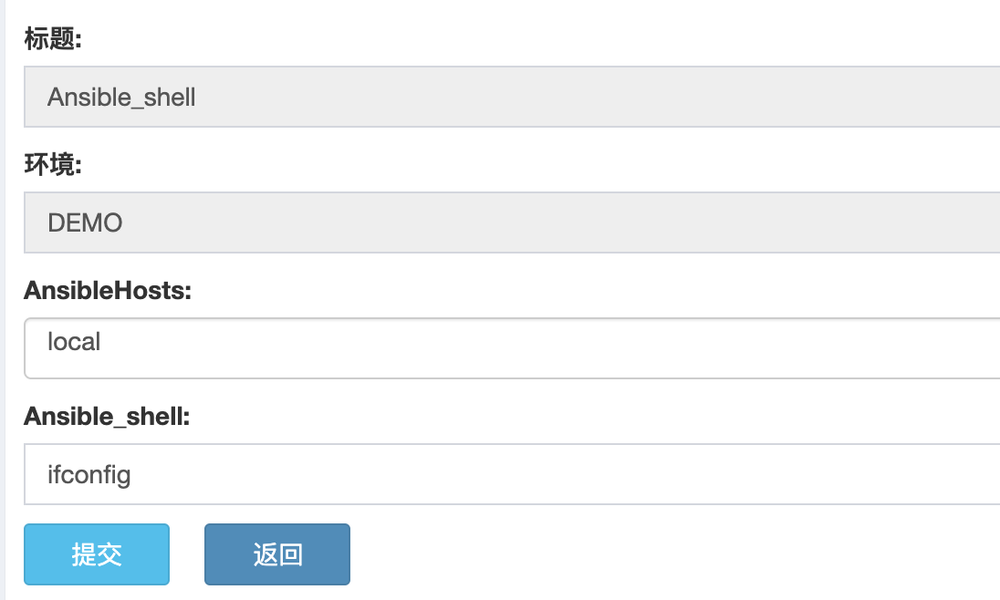
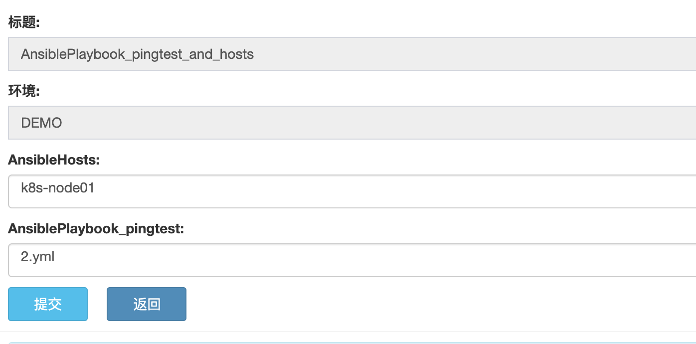
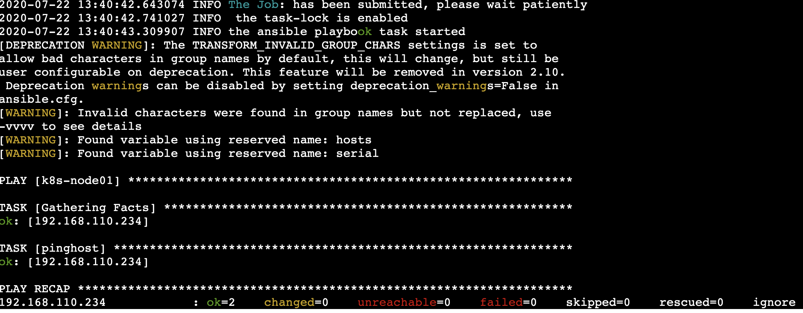

Ansible 部署插件使用指南
====================================

概述
--------------------------------

Ansible 部署插件，主要用于执行 hell 命令和 playbook。

*版本管理*

- 主要涉及到 hosts 文件和 palaybook yml 文件存放的对应目录。

目录说明
--------------------------------

.. code-block::   bash
      
    pl_ansible                      # 插件主目录
    ├── conf                        # 配置文件目录
    │   └── demo.json               # 配置文件模板
    ├── lib_pri
    │   └── __init__.py
    ├── main_ansible_playbook.py    # playbook 主任务脚本，用于执行 playbook yml 脚本
    ├── main_ansible_shell.py       # shell 主任务脚本，用于执行 shell 命令
    ├── vars_get_AnsibleHosts.py    # 变量获取脚本，用于获取ansible hosts
    └── vars_get_Playbook.py        # 变量获取脚本，用于获取playbook yml 文件

   

配置文件说明
--------------------------------

demo.json为例

.. code-block:: python

    {
        "ansible_hosts_file":"/etc/ansible/hosts",  # ansible hosts 文件
        "forks":"5",                                # 并发数

    //    playbook_path后面要加“/”
        "pingtest": { # 项目名称
            "playbook_path": "/Users/aomine/Documents/workspace/github/skstack_plugins/pl_ansible/playbook/", # 项目对应的 playbook 文件存放目录
            "hosts": "none",    # 指定需要部署到目标主机的ansible hosts group
            "serial": "1"   #serial 定义执行多少主机，可以为数字 1，2，3 也或者 20%，30%，指的是主机组里面并发执行多少台。
        }
    }

.. note::
      #. playbook_path：使用插件之前需要用户先配置好该项目的 playbook 文件目录，目录后面要加“/”。
      #. hosts：若显示指定为none，这插件会读取插件所在服务器的ansible hosts文件中group等于项目名的目标主机，若无则报错，建议在json文件中指定

..

脚本说明
--------------------------------

变量获取脚本
^^^^^^^^^^^^^^^^^^^^^^^^^^^^^^^^^

ansible hosts 获取脚本

.. code-block::   bash

   (skstack) [root@ansible pl_deploy_package]# python vars_get_AnsibleHosts.py
    usage: vars_get_AnsibleHosts.py [-h] [-e [prod|stage|...]]

    version 1.0.0

    optional arguments:
      -h, --help            show this help message and exit
      -e [prod|stage|...], --environment [prod|stage|...]
                            input the environment in which the script needs to be
                            executed

.. note::
      #. -e 指定配置文件，一般每个环境单独使用一个配置文件，详见最佳实例

..

ansible Playbook yaml 文件获取脚本

.. code-block::   bash

   (skstack) [root@ansible pl_deploy_package]# python vars_get_Playbook.py
    usage: vars_get_Playbook.py [-h] [-e [prod|stage|...]] [-p [project_name]]

    version 2.0.0

    optional arguments:
      -h, --help            show this help message and exit
      -e [prod|stage|...], --environment [prod|stage|...]
                            the environment you need deploy
      -p [project_name], --proj-package [project_name]
                            the ansible project name you want to depoly

.. note::
      #. -e 指定配置文件，一般每个环境单独使用一个配置文件，详见最佳实例
      #. -p 指定项目名称，详见最佳实例

..

主任务脚本
^^^^^^^^^^^^^^^^^^^^^^^^^^^^^^^^^

ansible shell 主任务脚本

.. code-block::   bash

   (skstack) [root@ansible pl_deploy_package]# python main_ansible_shell.py -h
    usage: main_ansible_shell.py [-h] [-e [prod|stage|dev|...]] [-g [gp01|ip|...]]
                                 [-c [ls|cd|...]]

    version 2.0.0

    optional arguments:
      -h, --help            show this help message and exit
      -e [prod|stage|dev|...], --environment [prod|stage|dev|...]
                            input the environment in which the script needs to be
                            executed
      -g [gp01|ip|...], --group [gp01|ip|...]
                            input the ansible hosts group
      -c [ls|cd|...], --command [ls|cd|...]
                            input the command

      
.. note::
      #. -e 指定配置文件，一般每个环境单独使用一个配置文件，详见最佳实例
      #. -g 指定 hosts 或者 hosts group 或者 ip 地址的目标主机
      #. -c 指定 shell 命令，目前 windows 环境还未验证过。
..   

ansible playbook 主任务脚本

.. code-block::   bash

   (skstack) [root@ansible pl_deploy_package]# python main_ansible_playbook.py -h
    usage: main_ansible_playbook.py [-h] [-e [prod|stage|dev]] [-p [proj1|proj2]]
                                    [-f playbook_name.yml] [-a [ansible-hosts]]

    version 2.0.0

    optional arguments:
      -h, --help            show this help message and exit
      -e [prod|stage|dev], --environment [prod|stage|dev]
                            the environment you need deploy
      -p [proj1|proj2], --project-name [proj1|proj2]
                            the project name you want to depoly
      -f playbook_name.yml, --playbook playbook_name.yml
                            input the command
      -a [ansible-hosts], --ansible-hosts [ansible-hosts]
                            the destination hosts you want to depoly

.. note::
      #. -e 指定配置文件，一般每个环境单独使用一个配置文件，详见最佳实例
      #. -p 指定需要操作的项目名字，该项目必须存在于指定配置文件当中
      #. -f 指定 playbook yml 配置文件
      #. -a 指定项目所在的目标主机，若为空则读取ansbile hosts文件中 与项目名一致的group。
..

Web模式示例
--------------------------------

# ansible shell 提单页面如下：

.. note::
      #. AnsibleHosts：获取版本按照名称排序，不按照 hosts 文件内容排序；

结果页展示：

.. image:: _images/ansible_shell_result.png
   :alt: image not found

.. note::
      #. 结果页面，参考 ansible 结果日志

# ansible playbook 提单页面如下：

.. note::
      #. AnsibleHosts：获取版本按照名称排序，不按照 hosts 文件内容排序；正常情况这里不再 web 端手动指定，是在 _conf.json 或者 playbook 里面已经指定好。
      #. AnsiblePlaybook_pingtest：选择 conf 配置文件中指定的 yml 存放目录里面的 playbook 脚本；

结果页展示：

.. note::
      #. 结果页面，参考 ansible 结果日志

命令行模式脚本示例
--------------------------------

# ansile shell 模式

项目变量获取

.. code-block::   bash
 
   (skstack) [root@ansible pl_deploy_package]# python vars_get_AnsibleHosts.py -e demo
    ['k8s-node01', 'k8s-node02', 'k8s-node03', 'k8s-node04', 'k8s-node05', 'k8s-node06', 'k8s-node07', 'k8s-node08', 'k8s-node09', 'local', 'node01', 'node02', 'node03', 'node:children', 'node:vars']

   
.. note::
      #. 如上表示从 -e 表示从 demo_conf.json 配置文件读取 ansible_hosts_file 的配置, 返回结果为 list，根据文件名进行排序。

      
      

主任务脚本

.. code-block::   bash

   (skstack) [root@devops pl_deploy_package]# python main_ansible_shell.py -e demo -g local -c "ls -l test"
    2020-07-22 13:50:01.822330 INFO the ansible shell task started
    [DEPRECATION WARNING]: The TRANSFORM_INVALID_GROUP_CHARS settings is set to allow bad characters in group names by default, this will change, but still be user configurable on deprecation. This feature will be removed in version
    2.10. Deprecation warnings can be disabled by setting deprecation_warnings=False in ansible.cfg.
    [WARNING]: Invalid characters were found in group names but not replaced, use -vvvv to see details
    [WARNING]: Platform darwin on host 127.0.0.1 is using the discovered Python interpreter at /usr/bin/python, but future installation of another Python interpreter could change this. See
    https://docs.ansible.com/ansible/2.9/reference_appendices/interpreter_discovery.html for more information.
    127.0.0.1 | CHANGED | rc=0 >>
    total 8
    -rw-r--r--  1 aomine  staff  138 Jun  9 17:19 Pipfile

.. note::
      #. -g 开源指定 hosts 也可以指定 hosts group

# ansile playbook 模式

项目变量获取

.. code-block::   bash

   (skstack) [root@ansible pl_deploy_package]# python vars_get_Playbook.py -e demo -p pingtest
    ['2.yml', '3.yml', '1.yml', 'pingtest.yml']

.. note::
      #. 如上表示 -e 表示从 demo_conf.json 配置文件读取-p pingtest 的项目的配置 playbook_path 的路径，将读取到 返回结果为 list 。

主任务脚本

.. code-block::   bash

   (skstack) [root@devops pl_deploy_package]# python main_ansible_playbook.py  -e demo -p pingtest -f 2.yml
    2020-07-22 13:59:20.253445 INFO the ansible playbook task started
    [DEPRECATION WARNING]: The TRANSFORM_INVALID_GROUP_CHARS settings is set to allow bad characters in group names by default, this will change, but still be user configurable on deprecation. This feature will be removed in version
    2.10. Deprecation warnings can be disabled by setting deprecation_warnings=False in ansible.cfg.
    [WARNING]: Invalid characters were found in group names but not replaced, use -vvvv to see details
    [WARNING]: Found variable using reserved name: hosts
    [WARNING]: Found variable using reserved name: serial

    PLAY [node] ******************************************************************************************************************************************************************************************************************************

    TASK [Gathering Facts] *******************************************************************************************************************************************************************************************************************
    ok: [192.168.110.245]

    TASK [pinghost] **************************************************************************************************************************************************************************************************************************
    ok: [192.168.110.245]

    PLAY [node] ******************************************************************************************************************************************************************************************************************************

    TASK [Gathering Facts] *******************************************************************************************************************************************************************************************************************
    ok: [192.168.110.246]

    TASK [pinghost] **************************************************************************************************************************************************************************************************************************
    ok: [192.168.110.246]

    PLAY [node] ******************************************************************************************************************************************************************************************************************************

    TASK [Gathering Facts] *******************************************************************************************************************************************************************************************************************
    ok: [192.168.110.247]

    TASK [pinghost] **************************************************************************************************************************************************************************************************************************
    ok: [192.168.110.247]

    PLAY RECAP *******************************************************************************************************************************************************************************************************************************
    192.168.110.245            : ok=2    changed=0    unreachable=0    failed=0    skipped=0    rescued=0    ignored=0
    192.168.110.246            : ok=2    changed=0    unreachable=0    failed=0    skipped=0    rescued=0    ignored=0
    192.168.110.247            : ok=2    changed=0    unreachable=0    failed=0    skipped=0    rescued=0    ignored=0

.. note::
      #. 指定目标主机模式：python main_ansible_playbook.py  -e demo -p pingtest -f 2.yml -a 192.168.110.245

最佳实践
--------------------------------

步骤概述
^^^^^^^^^^^^^^^^^^^^^^^^^^^^^^^^^

 #. 安装
 #. 配置各环节的 ansible 免密认证，并测试环境可以使用
 #. 配置各环境的json配置文件
 #. 项目变量获取脚本测试
 #. 主任务脚本测试
 #. 配置skstack web工单系统将各项目注册到工单系统，以方便用户通过web完成自动化发布流程，配置步骤如下：
 
    - 注册工单可选变量并校验
    - 配置变量组管理工单可选变量
    - 配置工单，关联变量组、主任务运行脚本、和相关运行参数

安装
^^^^^^^^^^^^^^^^^^^^^^^^^^^^^^^^^

 #. 不同环境单独使用一台ansible服务器作为作为配置管理服务器；如prod一台ansible， stage一台ansible。
 #. 将skstack_plugins插件库安装到ansible服务器的/opt/soft/目录。
 #. skstack web将不同环境的ansible服务器（插件库所在服务器）注册到skstack 工单系统

配置文件
^^^^^^^^^^^^^^^^^^^^^^^^^^^^^^^^^

::

   如生产环境代号prod 准生产环境为stage，可以为每个环境单独准备一份配置文件；
   复制demo.json生成两个配置文件：prod_conf.json  stage_conf.json。配置文件必须以_conf.json 结尾，否则插件库中的脚本不会识别
   具体配置参数，参考配置文件说明章节

项目变量获取脚本测试
^^^^^^^^^^^^^^^^^^^^^^^^^^^^^^^^^

使用项目变量获取脚本检查是否可以获取到指定关键字项目列表，详见命令行模式脚本效果演示章节

任务脚本功能测试
^^^^^^^^^^^^^^^^^^^^^^^^^^^^^^^^^

 #.使用方法详见命令行模式脚本效果演示章节

.. note::
      #. 执行主任务脚本之前，需先完成 ansible 服务器到目标服务器的认证，保证 ansible 可以管理目标服务器

Skstack Web工单系统配置
^^^^^^^^^^^^^^^^^^^^^^^^^^^^^^^^^

# ansible shell 工单配置
  
1 注册工单可选变量并校验，需要配置两个可选变量，参数配置如下：

::

    变量名：Ansible_shell
    变量表单标签名字：shell 命令行
   描述：此变量相关描述内容
   变量取值方法：用户输入
   变量表单类型：单行用户输入或者多行用户输入
   变量值：为空（因这里使用用户生成可选变量，非管理员定义，所以无需定义）
   变量获取脚本：为空
   所属环境：PROD （若无请先添加环境分类）
   所属分类：DeployAnsible （若无请先添加用途分类）
   

::

    变量名：AnsibleHosts
    变量表单标签名字：ansible hosts 主机
   描述：此变量相关描述内容
   变量取值方法：脚本生成
   变量表单类型：单选 select2下拉框
   变量值：为空（因这里使用用户生成可选变量，非管理员定义，所以无需定义）
   变量获取脚本：/root/.virtualenvs/skstack/bin/python /opt/soft/skstack_plugins/pl_ansible/vars_get_AnsibleHosts.py -e prod
   所属环境：PROD （若无请先添加环境分类）
   所属分类：DeployAnsible （若无请先添加用途分类）
 
2 配置变量组管理工单可选变量

::

   名字：AnsibleHosts_shell
   描述：此变量相关描述内容
   变量：AnsibleHosts  Ansible_shell（关联上述步骤配置的变量）
   所属环境：PROD （若无请先添加环境分类）
   所属分类：DeployAnsible （若无请先添加用途分类）

 
3 配置工单，关联变量组、主任务运行脚本、和相关运行参数

::

   工单名字：Ansible_shell
   项目描述：改工单所发布的项目进行简要描述，方便提单用户通过帮助按钮阅读
   提单权限用户：选择具有提单权限的用户组，需要先到用户管理界面添加相关用户组
   项目环境：PROD
   项目分类：DeployAnsible
   是否激活工单：激活   #未激活工单，提单用户无法看到
   内置变量：为空
   可选参数组：AnsibleHosts_shell（关联上述步骤配置的变量组）
    前置任务: 留空
   主任务：/root/.virtualenvs/skstack/bin/python /opt/soft/skstack_plugins/pl_ansible/main_ansible_shell.py -e demo -g {AnsibleHosts} -c {Ansible_shell}
   后置任务：留空
   是否开启审核：此处不勾选，若需使用审核流程，可参考用户系统，审核流程配置环节
   审核流程：若需使用审核流程，可参考用户系统，审核流程配置环节
   其余选项：参考用户手册》工单配置；选择是否使用开启其他附加功能
   配置中心：若skstack_plugins插件库和skstack web平台不在同一台服务器此处需要选择插件库所在的服务器，默认为空表示，插件库和skstack web工单系统共用一个操作系统实例

    
# ansible playbook 工单配置

1 注册工单可选变量并校验，需要配置两个可选变量，参数配置如下：

::

    变量名：proj1
    变量表单标签名字：playbook 配置文件
   描述：此变量相关描述内容
   变量取值方法：脚本生成
   变量表单类型：单选 select2 下拉框
   变量值：为空（因这里使用用户生成可选变量，非管理员定义，所以无需定义）
   变量获取脚本：/root/.virtualenvs/skstack/bin/python /opt/soft/skstack_plugins/pl_ansible/vars_get_Playbook.py -e prod -p proj1
   所属环境：PROD （若无请先添加环境分类）
   所属分类：DeployAnsible （若无请先添加用途分类）

2 配置变量组管理工单可选变量

::

   名字：proj1
   描述：此变量相关描述内容
   变量：proj1（关联上述步骤配置的变量）
   所属环境：PROD （若无请先添加环境分类）
   所属分类：DeployAnsible （若无请先添加用途分类）

3 配置工单，关联变量组、主任务运行脚本、和相关运行参数

::

   工单名字：proj1
   项目描述：改工单所发布的项目进行简要描述，方便提单用户通过帮助按钮阅读
   提单权限用户：选择具有提单权限的用户组，需要先到用户管理界面添加相关用户组
   项目环境：PROD
   项目分类：DeployAnsible
   是否激活工单：激活   #未激活工单，提单用户无法看到
   内置变量：{"AnsibleProjName":"proj1"}
   可选参数组：proj1（关联上述步骤配置的变量组）
    前置任务: 留空
   主任务：/root/.virtualenvs/skstack/bin/python /opt/soft/skstack_plugins/pl_ansible/main_ansible_playbook.py -e demo -p {AnsibleProjName} -f {proj1}
   后置任务：留空
   是否开启审核：此处不勾选，若需使用审核流程，可参考用户系统，审核流程配置环节
   审核流程：若需使用审核流程，可参考用户系统，审核流程配置环节
   其余选项：参考用户手册》工单配置；选择是否使用开启其他附加功能
   配置中心：若skstack_plugins插件库和skstack web平台不在同一台服务器此处需要选择插件库所在的服务器，默认为空表示，插件库和skstack web工单系统共用一个操作系统实例

