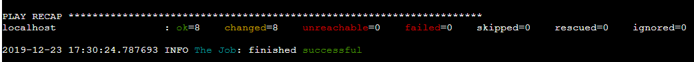

Docker部署插件使用指南
==============================

概述
--------------------------------

*docker部署插件支持如下几种执行模式*

::

	update：版本更新优雅模式，过程如下：
	
		1. 下载镜像 ；
		2.  从eureka注销服务（未使用eureka则跳过该步骤）；
		3. 等待eureka刷新缓存（未使用eureka则跳过该步骤） ；
		4. 停止服务 ；
		5. 启动新镜像；
		6. eureka健康检测（未使用eureka则跳过该步骤）
	
	restart：重启服务
	  
	inquery：版本查询
	
	rollback：回滚，回滚到当前项目docker状态为Exit的最新版本；只能回滚一次，若执行多次，会在最新两个版本之间来回变更。
	
	update_hard：版本更新强制模式，过程如下：
	
		1. 下载镜像   
		2. 停止服务 
		3. 启动新镜像；hard模式用于常规update模式无法更新或者第一次发布服务的情况。

.. note::
	  #. 部署方式：多个节点情况下为滚动更新；
	  #. 未使用eureka服务的项目update模式过程与update_hard模式一致
..

*版本管理*

- docker run启动的时候指定docker name为“项目名-时间戳”的方式定义当前发布版本，如：demo1-20191224.022231
- docker发布的历史版本都在目标服务器上面，如下查询某个项目当前所有版本

.. code-block::	bash

	(skstack) [root@localhost pl_deploy_docker]# python main_docker_deploy.py -e stage -p demo1 -m inquiry
	 localhost | CHANGED | rc=0 >>
	CONTAINER ID        IMAGE                                                                               COMMAND                  CREATED             STATUS                        PORTS                                            NAMES
	da2ccd657c61        registry.cn-hongkong.aliyuncs.com/namespace/demo1:latest         "java -javaagent:/..."   17 hours ago        Up 17 hours                                                                    demo1-20191223.092915
	f289e56dc36f        registry.cn-hongkong.aliyuncs.com/namespace/demo1:latest         "java -javaagent:/..."   17 hours ago        Exited (143) 17 hours ago                                                      demo1-20191223.090808
	55414f6c1709        registry.cn-hongkong.aliyuncs.com/namespace/demo1:latest         "java -javaagent:/..."   18 hours ago        Exited (143) 17 hours ago                                                      demo1-20191223.085341
	22f189b2984a        registry.cn-hongkong.aliyuncs.com/namespace/demo1:latest         "java -javaagent:/..."   18 hours ago        Exited (143) 18 hours ago                                                      demo1-20191223.085210

目录说明
--------------------------------

.. code-block::	bash

	pl_deploy_docker/			#docker部署插件主目录
	├── conf					#配置文件目录
	│   ├── demo.json			#配置文件参考模板
	│   ├── prod_conf.json		#_conf.json结尾的文件为用户定义的线上配置文件
	│   └── stage_conf.json
	├── main_docker_deploy.py	#docker部署插件主任务脚本
	├── sc_docker_rollback.py		
	├── sc_eureka_health_check.sh
	├── sc_restart.yml
	├── sc_rollback.yml
	├── sc_update_hard.yml
	├── sc_update_soft.yml
	└── var_json_keys.py		#如需将多个项目合并到一个工单上面，可以通过该变量获取脚本获取配置文件里面的多个项目名称
	

配置文件说明
--------------------------------

.. code-block:: python

	{
	
		"public": { #所有项目共有配置参数区域
			"EurekaUrl": "http://eureka.demo.com:9001" #eureka地址，若无可以留空
		},
	
		"demo1": {#项目名与docker镜像名称保持一致
			"DockerImageURL": "registry.cn-hongkong.aliyuncs.com/namespace_demo/",  #docker镜像命名空间地址
			"hosts": "demo1",	#指定需要部署到目标主机的ansible hosts group
			"DockerRunArg": " -d -m 1000m -v /data/logs:/logs", #docker run 指定运行参数，可为空
			"DockerRunCmd": "",  #指定docker起来后运行的命令，覆盖docker file构建时的默认命令，可为空
			"AppSpringName": "null"  #指定该项目注册在eureka中的生产者名称，指定为null表示不会使用eureka健康检测和优雅关闭模块，直接使用docker stop命令关闭服务。
		},
	
		"demo2": {
			"DockerImageURL": "registry.cn-hongkong.aliyuncs.com/namespace_demo/",
			"hosts": "none",
			"DockerRunArg": "",
			"DockerRunCmd": "java  -jar -Xms2g -Xmx4g demo2.jar --spring.config.location=file:./config/demo2.yml",
			"AppSpringName": "demo2"
		}
	}

.. note::
	  #. DockerImageURL：使用插件之前需要用户先自己完成服务器到镜像仓库认证，插件不负责认证;镜像地址拼接方式为DockerImageURL+"项目名字"+":latest"
	  #. hosts：，若显示指定为none，这插件会读取插件所在服务器的ansible hosts文件中group等于项目名的目标主机，若无则报错，建议在json文件中指定
	  #. public key为配置文件内置参数，用于指定EurekaUrl和后期需要扩展的其他公共参数，项目名不可使用该key命名
..

脚本说明
--------------------------------

变量获取脚本
^^^^^^^^^^^^^^^^^^^^^^^^^^^^^^^^^

如果使用默认latest标签发布docker项目，一个工单可以只关联一个项目，也可以通过项目变量获取脚本关联多个项目

.. code-block::	bash

	(skstack) [root@localhost pl_deploy_docker]# python var_json_keys.py -h
	usage: var_json_keys.py [-h] [-k [keyword1|keyword2]] [-e [prod|stage|dev]]
	
	version 2.0.0
	
	optional arguments:
	  -h, --help            show this help message and exit
	  -k [keyword1|keyword2], --filter-keyword [keyword1|keyword2]
	                        the project keyword you want to filter
	  -e [prod|stage|dev], --environment [prod|stage|dev]
	                        the environment you need deploy

.. note::
	  #. -k 指定关键字可以从配置文件中过滤包含此关键字的项目，详见最佳实例
	  #. -e 指定配置文件，一般每个环境单独使用一个配置文件，详见最佳实例
..

主任务脚本
^^^^^^^^^^^^^^^^^^^^^^^^^^^^^^^^^

.. code-block::	bash

	(skstack) [root@localhost pl_deploy_docker]# python main_docker_deploy.py -h
	usage: main_docker_deploy.py [-h] [-e [prod|stage|dev...]]
	                             [-p [proj01|proj02|...]] [-t [v0.1.0|latest|...]]
	                             [-a [192.168.1.22|AnsbileHostsName|...]]
	                             [-w [3s|1m|...]]
	                             [-m [update|restart|inquiry|rollback|update_hard]]
	
	version 2.0.0
	
	optional arguments:
	  -h, --help            show this help message and exit
	  -e [prod|stage|dev...], --Environment [prod|stage|dev...]
	                        input the environment in which the script needs to be
	                        executed
	  -p [proj01|proj02|...], --proj-docker [proj01|proj02|...]
	                        the docker project you want to depoly
	  -t [v0.1.0|latest|...], --DockerImageTag [v0.1.0|latest|...]
	                        input the docker image tag default=latest
	  -a [192.168.1.22|AnsbileHostsName|...], --AnsibleHosts [192.168.1.22|AnsbileHostsName|...]
	                        input AnsibleHosts,default is the same as -p parameter
	  -w [3s|1m|...], --WaitTimes [3s|1m|...]
	                        input securyty wait times for rolling update
	                        default=60s
	  -m [update|restart|inquiry|rollback|update_hard], --ExecMode [update|restart|inquiry|rollback|update_hard]
	                        input the execution mode you need
	
.. note::
	  #. -e 指定配置文件，一般每个环境单独使用一个配置文件，详见最佳实例
	  #. -p 指定需要操作的项目名字，该项目必须存在于指定配置文件当中
	  #. -t 指定所属项目的docker标签，默认为latest
	  #. -a 指定项目所在的目标主机，若为空则读取ansbile hosts文件中 与项目名一致的group。
	  #. -w 指定安全等待时间，只在update 和rollback模式下使用了eureka的项目用于健康检测和优雅关闭服务使用
	  #. -m 指定执行模式，执行模式描述详见概述部分内容
..	

Web模式效果演示
--------------------------------

提单页面如下：

.. image:: _images/docker_submit.png
   :alt: image not found

.. note::
	  #. Project项下来菜单表示为该工单可选的docker项目，通过插件变量获取脚本从配置文件获取指定项目；
	  #. 多个docker项目可以合并到一个工单上，也可以一个docker项目使用一个工单

结果页展示：

   
.. note::
	  #. 结果页面，参考ansible结果日志

 

命令行模式脚本效果演示
--------------------------------

项目变量获取

.. code-block::	bash
 
	(skstack) [root@localhost pl_deploy_docker]# python var_json_keys.py -e prod -k demo
	['demo1', 'demo2']
	
.. note::
	  #. 如上表示从-e表示从prod_conf.json 读取 包含demo关键字的项目，返回结果为list。

主任务脚本-优雅更新模式

.. code-block::	bash

	(skstack) [root@localhost pl_deploy_docker]# python main_docker_deploy.py -e stage -p demo1 -a localhost -w 1s -m update
	
	PLAY [localhost] ****************************************************************************************************************************************************************************************
	
	TASK [Step:1/8:Get the AppInstance ID(e.host:port) from eureka.] ****************************************************************************************************************************************
	...
	TASK [Step:2/8:Get the DockerAppId which is running.] ***************************************************************************************************************************************************
	...
	TASK [Step:3/8:Download docker image.] ******************************************************************************************************************************************************************
	...
	TASK [Step:4/8:Deregister service.] *********************************************************************************************************************************************************************
	...
	TASK [Step:5/8:Securyty wait times for eureka server&client cache refresh (default 60s).] ***************************************************************************************************************
	...
	TASK [Step:6/8:Docker app stop.] ************************************************************************************************************************************************************************
	...
	TASK [Step:7/8:Docker app run.] *************************************************************************************************************************************************************************
	...
	TASK [Step:8/8:LoopHealthCheck until successful, max time(2min).] ***************************************************************************************************************************************
	...
	PLAY RECAP **********************************************************************************************************************************************************************************************
	localhost                  : ok=8    changed=8    unreachable=0    failed=0    skipped=0    rescued=0    ignored=0
	
	(skstack) [root@localhost pl_deploy_docker]#

.. note::
	  #. update简易执行模式：python main_docker_deploy.py -e stage -p demo1 -m update
	  #. update指定目标主机和等待时间模式：python main_docker_deploy.py -e stage -p demo1 -a localhost -w 1s -m update
	  #. restart简易执行模式：python main_docker_deploy.py -e stage -p demo1 -m restart
	  #. inquiry简易执行模式：python main_docker_deploy.py -e stage -p demo1 -m inquiry
	  #. rollback简易执行模式：python main_docker_deploy.py -e stage -p demo1 -m rollback
	  #. update_hard]简易执行模式：python main_docker_deploy.py -e stage -p demo1 -m update_hard]

最佳实践
--------------------------------

步骤概述
^^^^^^^^^^^^^^^^^^^^^^^^^^^^^^^^^

 #. 配置各环境的配置文件
 #. docker镜像仓库认证
 #. 项目变量获取脚本检查
 #. 使用主任务脚本update_hard简易执行模式验证是否可以正常发布，第一次发布必须使用update_hard模式，以跳过eureka健康检查和优雅关闭步骤。
 #. 配置skstack web工单系统将各项目注册到工单系统，以方便用户通过web完成自动化发布流程，配置步骤如下：
 
	 - 注册工单可选变量并校验
	 -  配置变量组管理工单可选变量
	 - 配置工单，关联变量组、主任务运行脚本、和相关运行参数

步骤1：配置文件
^^^^^^^^^^^^^^^^^^^^^^^^^^^^^^^^^

::

	如生产环境代号prod 准生产环境为stage，可以为每个环境单独准备一份配置文件；
	复制demo.json生成两个配置文件：prod_conf.json  stage_conf.json。配置文件必须以_conf.json 结尾，否则插件库中的脚本不会识别
	具体配置参数，参考配置文件说明章节

步骤2：docker镜像仓库认证
^^^^^^^^^^^^^^^^^^^^^^^^^^^^^^^^^

完成目标服务器到docker镜像仓库认证

步骤3：项目变量获取脚本检查
^^^^^^^^^^^^^^^^^^^^^^^^^^^^^^^^^

使用项目变量获取脚本检查是否可以获取到指定关键字项目列表，详见命令行模式脚本效果演示章节

步骤4：主任务脚本功能检查
^^^^^^^^^^^^^^^^^^^^^^^^^^^^^^^^^

 #.使用主任务脚本update_hard简易执行模式验证是否可以正常发布，第一次发布必须使用update_hard模式，以跳过eureka健康检查和优雅关闭步骤。
 #.依次使用update inquiry restart rollback 简易模式验证其他模式是否工作正常
 #.使用方法详见命令行模式脚本效果演示章节

步骤5：skstack web工单系统配置
^^^^^^^^^^^^^^^^^^^^^^^^^^^^^^^^^

.. _user-vars:
  
1 注册工单可选变量并校验，需要配置两个可选变量，参数配置如下：

::

	 变量名：group1
	 变量表单标签名字：Project
	描述：描述内容
	变量取值方法：脚本生成
	变量表单类型：单选select2下拉框
	变量值：为空（因这里使用脚本生成可选变量，非管理员定义，所以无需定义）
	变量获取脚本：python /opt/soft/skstack_plugins/pl_deploy_docker/var_json_keys.py -e prod -k group1
	所属环境：PROD （若无请先添加环境分类）
	所属分类：DeployDocker （若无请先添加用途分类）
	
	变量名：DockerDeployMode
	 变量表单标签名字：ExecMode
	描述：描述内容
	变量取值方法：管理员定义
	变量表单类型：单选icheck Radio
	变量值：["update","restart","inquiry","rollback","update_hard"]
	变量获取脚本：为空
	所属环境：PROD （若无请先添加环境分类）
	所属分类：DeployDocker （若无请先添加用途分类）
 
2 配置变量组管理工单可选变量

::

	名字：docker_deploy_group1
	描述：描述内容
	变量：group1 DockerDeployMode （关联上述步骤配置的变量）
	所属环境：PROD （若无请先添加环境分类）
	所属分类：DeployDocker （若无请先添加用途分类）

 
3 配置工单，关联变量组、主任务运行脚本、和相关运行参数

::

	工单名字：project_group1
	项目描述：改工单所发布的项目进行简要描述，方便提单用户通过帮助按钮阅读
	提单权限用户：选择具有提单权限的用户组，需要先到用户管理界面添加相关用户组
	可选参数组：docker_deploy_group1
	前置任务：留空
	主任务：python   /opt/soft/skstack_plugins/pl_deploy_docker/main_docker_deploy.py -e prod -m {DockerDeployMode} -p {group1}  
	后置任务：留空
	是否开启审核：此处不勾选，若需使用审核流程，可参考用户系统，审核流程配置环节
	审核流程：若需使用审核流程，可参考用户系统，审核流程配置环节
	其余选项：暂未上线，不勾选
	配置中心：若skstack_plugins插件库和skstack web平台不在同一台服务器此处需要选择插件库所在的服务器，默认为空表示，插件库和skstack web工单系统共用一个操作系统实例

	 
