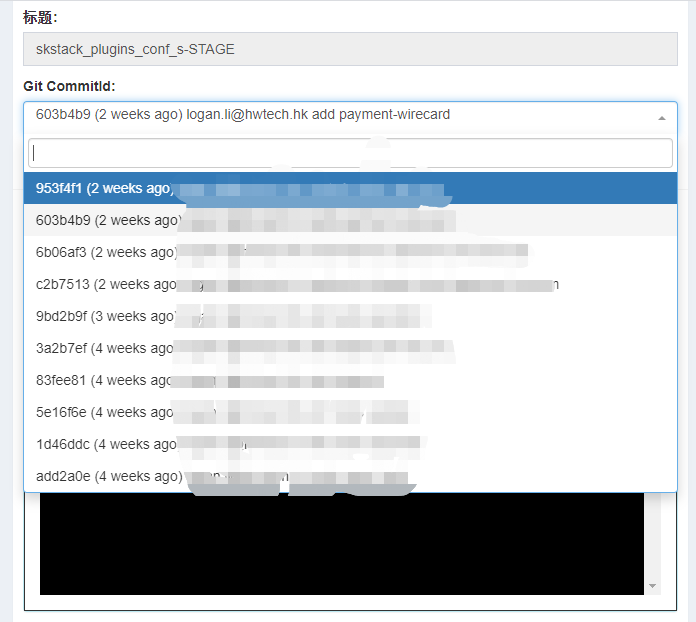
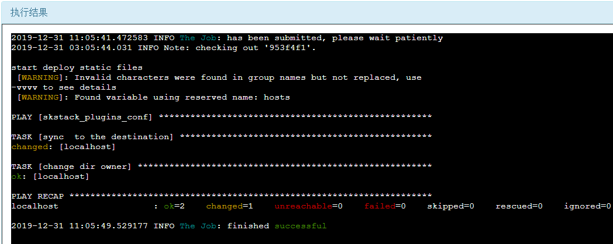

Git静态文件部署插件使用指南
==============================

概述
--------------------------------

git部署插件，主要用于部署git类静态文件项目，版本发布和回滚都基于指定分支的commit id。

*版本管理*

- 基于gitlab仓库，或者其他git仓库镜像，的master或者其他指定分支，commit id进行版本管理

目录说明
--------------------------------

.. code-block::	bash
	
	pl_deploy_git/				#插件主目录
	├── conf					#配置文件目录
	│   ├── demo.json			#配置文件模板
	├── lib_pri
	│   ├── git.py
	├── main_git_deploy.py      #主任务脚本，用于将项目文件同步到目标服务器
	├── pre_git_pull.py			#前置任务脚本，用于将项目文件从git上pull下来，并切换到指定commit id
	├── sc_static_sync.yml		#主任务模块调用的ansible playbook，用来同步文件到目标服务器使用
	└── var_git_commit_id.py    #变量获取脚本，用于获取指定分支的commit id 最近前10次提交。
	

配置文件说明
--------------------------------

demo.json为例

.. code-block:: python

	{
	
		"proj1":{  #项目名称
			 "type":"git",   #项目类型，必须指定为git
			 "hosts": "demo1",	#指定需要部署到目标主机的ansible hosts group
			 "repo_url": "http://git_host/path/proj1.git",  #项目git地址
			 "proj_local_path":"/opt/gitsource/proj1",     #项目拉取到本地仓库的路径
			 "deploy_src_path":"/opt/gitsource/proj1",     #项目本地源文件路径
			 "deploy_dest_path":"/opt/soft/",  #项目目标服务器路径
			 "rsync_opts":[],  			#排除项指定无需同步的文件，必须指定为list类型，格式见proj2；空list表示没有文件排除，整个源目录同步，.
			 "delete_enable":"no",      #是否删除目标服务器目录存在而源目录不存在的文件。
			 "owner": "nginx",			#文件和目录所属系统用户权限
			 "group": "nginx"},			#文件和目录所属系统用户组权限
		
		"proj2":{
			 "type":"git",
			 "hosts": "none",	
			 "repo_url": "http://git_host/path/proj2.git",
			 "proj_local_path":"/opt/gitsource/proj2",
			 "deploy_src_path":"/opt/gitsource/proj2/sub1/",
			 "deploy_dest_path":"/opt/soft/proj2/",
			 "rsync_opts":["--no-motd","--exclude=RedisConnect.php","--exclude=config","--exclude=runtime"],
			 "delete_enable":"no",
			 "owner": "nginx",
			 "group": "nginx"}
	
	}

.. note::
	  #. repo_url：使用插件之前需要用户先自己完成插件服务器到git镜像仓库认证，插件不负责认证。保证在插件服务器可以通过git clone和git pull命令拉取代码。
	  #. hosts：若显示指定为none，这插件会读取插件所在服务器的ansible hosts文件中group等于项目名的目标主机，若无则报错，建议在json文件中指定
	  #. type：项目保留参数，方便后期插件功能扩展，目前必须指定为git。
	  #. rsync_opts：参数定义参考ansible playbook synchronize模块的rsync_opts参数定义

..

脚本说明
--------------------------------

变量获取脚本
^^^^^^^^^^^^^^^^^^^^^^^^^^^^^^^^^

如果使用默认latest标签发布docker项目，一个工单可以只关联一个项目，也可以通过项目变量获取脚本关联多个项目

.. code-block::	bash

	(skstack) [root@ansible pl_deploy_git]# python var_git_commit_id.py -h
	usage: var_git_commit_id.py [-h] [-p [git_project_name]] [-e [prod|stage|dev]]
	                            [-b [master|feature-xxx]]
	
	version 2.0.0
	
	optional arguments:
	  -h, --help            show this help message and exit
	  -p [git_project_name], --proj-git [git_project_name]
	                        the static git project name you want to depoly
	  -e [prod|stage|dev], --environment [prod|stage|dev]
	                        the environment you need deploy
	  -b [master|feature-xxx], --branch [master|feature-xxx]
	                        the git branch you need deploy default=master

.. note::
	  #. -p 指定git项目名称，详见最佳实例
	  #. -e 指定配置文件，一般每个环境单独使用一个配置文件，详见最佳实例
	  #. -e 指定分支，默认为master
..

主任务脚本
^^^^^^^^^^^^^^^^^^^^^^^^^^^^^^^^^

.. code-block::	bash

	(skstack) [root@ansible pl_deploy_git]# python main_git_deploy.py -h
	usage: main_git_deploy.py [-h] [-e [prod|stage|dev]] [-p [git_project_name]]
	                          [-a [ansible-hosts]]
	
	version 2.0.0
	
	optional arguments:
	  -h, --help            show this help message and exit
	  -e [prod|stage|dev], --environment [prod|stage|dev]
	                        the environment you need deploy
	  -p [git_project_name], --proj-git [git_project_name]
	                        the static git project name you want to depoly
	  -a [ansible-hosts], --ansible-hosts [ansible-hosts]
	                        the destination hosts you want to depoly
		
.. note::
	  #. -e 指定配置文件，一般每个环境单独使用一个配置文件，详见最佳实例
	  #. -p 指定需要操作的git项目名字，该项目必须存在于指定配置文件当中
	  #. -a 指定项目所在的目标主机，若为空则读取ansbile hosts文件中 与项目名一致的group。
..	

Web模式效果演示
--------------------------------

提单页面如下：

.. note::
	  #. commit id下拉菜单表示最近十次的提交记录，按照时间排序，最新的提交在最前面；

结果页展示：

   
.. note::
	  #. 结果页面，参考ansible结果日志

 

命令行模式脚本效果演示
--------------------------------

项目变量获取

.. code-block::	bash
 
	(skstack) [root@ansible pl_deploy_git]# python var_git_commit_id.py -e stage -p skstack_plugins_conf -b master
	['953f4f1 (2 weeks ago)  demouser@github.com add market config', '603b4b9 (2 weeks ago)  demouser@github.com add payment config', .........]

	
.. note::
	  #. 如上表示从-e表示从stage_conf.json 读取 包含skstack_plugins_conf关键字的项目，返回结果为list,只返回最新10次提交记录
	  #. 如上表示从-b表示从master分支读取，最新10次提交记录，-b参数默认为master，此处可以省略。
	  
	  
前置任务脚本

.. code-block::	bash

	(skstack) [root@ansible pl_deploy_git]# python pre_git_pull.py -e stage -p skstack_plugins_conf -i 953f4f1
	2019-12-31 03:15:30.031 INFO Note: checking out '953f4f1'.	  
	
.. note::
	  #. 执行前置任务脚本之前，可以先通过变量获取脚本获取某个项目的提交记录，或者直接通过git仓库获取提交记录
	  #. -i 参数表示指定的commit id。

主任务脚本

.. code-block::	bash

	(skstack) [root@ansible pl_deploy_git]# python main_git_deploy.py -e stage -p skstack_plugins_conf
	start deploy static files
	 [WARNING]: Invalid characters were found in group names but not replaced, use -vvvv to see details
	 [WARNING]: Found variable using reserved name: hosts
	
	PLAY [skstack_plugins_conf] ********************************************************************************************************************************************************************************************
	
	TASK [sync  to the destination] ****************************************************************************************************************************************************************************************
	ok: [localhost]
	
	TASK [change dir owner] ************************************************************************************************************************************************************************************************
	ok: [localhost]
	
	PLAY RECAP *************************************************************************************************************************************************************************************************************
	localhost                  : ok=2    changed=0    unreachable=0    failed=0    skipped=0    rescued=0    ignored=0

.. note::
	  #. 指定目标主机模式：python main_git_deploy.py -e stage -p skstack_plugins_conf -a host1
	  #. 执行主任务脚本之前需要先执行前置任务脚本拉取想要部署的指定分支commit id文件

最佳实践
--------------------------------

步骤概述
^^^^^^^^^^^^^^^^^^^^^^^^^^^^^^^^^

 #. 安装
 #. 配置各环境的json配置文件
 #. 各项目git镜像仓库认证
 #. 项目变量获取脚本测试
 #. 前置任务、主任务脚本测试
 #. 配置skstack web工单系统将各项目注册到工单系统，以方便用户通过web完成自动化发布流程，配置步骤如下：
 
	 - 注册工单可选变量并校验
	 -  配置变量组管理工单可选变量
	 - 配置工单，关联变量组、主任务运行脚本、和相关运行参数

安装
^^^^^^^^^^^^^^^^^^^^^^^^^^^^^^^^^

 #. 不同环境单独使用一台ansible服务器作为作为配置管理服务器；如prod一台ansible， stage一台ansible。
 #. 将skstack_plugins插件库安装到ansible服务器的/opt/soft/目录，并创建/opt/gitsource/目录作为git项目文件的临时版本库。
 #. skstack web将不同环境的ansible服务器（插件库所在服务器）注册到skstack 工单系统

配置文件
^^^^^^^^^^^^^^^^^^^^^^^^^^^^^^^^^

::

	如生产环境代号prod 准生产环境为stage，可以为每个环境单独准备一份配置文件；
	复制demo.json生成两个配置文件：prod_conf.json  stage_conf.json。配置文件必须以_conf.json 结尾，否则插件库中的脚本不会识别
	具体配置参数，参考配置文件说明章节

Git镜像仓库认证
^^^^^^^^^^^^^^^^^^^^^^^^^^^^^^^^^

各环境json配置文件指定插件git本地仓库地址 "proj_local_path":"/opt/gitsource/proj1", 进入仓库地址，并执行git clone，git pull命令，人工完成到git仓库的认证，保证后续执行git pull无需再次输入密码。

项目变量获取脚本测试
^^^^^^^^^^^^^^^^^^^^^^^^^^^^^^^^^

使用项目变量获取脚本检查是否可以获取到指定关键字项目列表，详见命令行模式脚本效果演示章节

任务脚本功能测试
^^^^^^^^^^^^^^^^^^^^^^^^^^^^^^^^^

 #.使用前置任务脚本测试，保证指定配置文件的项目可以切换到指定分支
 #.使用主任务脚本保证，可以将发布插件本地仓库的文件同步到目标服务器；
 #.使用方法详见命令行模式脚本效果演示章节

.. note::
	  #. 执行主任务脚本之前，需先完成ansible服务器到目标服务器的认证，保证ansible可以管理目标服务器

Skstack Web工单系统配置
^^^^^^^^^^^^^^^^^^^^^^^^^^^^^^^^^

  
1 注册工单可选变量并校验，需要配置两个可选变量，参数配置如下：

::

	 变量名：skstack_conf_git
	 变量表单标签名字：Git CommitId
	描述：skstack_conf项目最新10次git提交记录变量list
	变量取值方法：脚本生成
	变量表单类型：单选select2下拉框
	变量值：为空（因这里使用脚本生成可选变量，非管理员定义，所以无需定义）
	变量获取脚本：python /opt/soft/skstack_plugins/pl_deploy_git/var_git_commit_id.py -e prod -p skstack_plugins_conf
	所属环境：PROD （若无请先添加环境分类）
	所属分类：DeployGit （若无请先添加用途分类）
	

 
2 配置变量组管理工单可选变量

::

	名字：skstack_conf_public
	描述：skstack_conf工单使用的提供给用户的可选变量组
	变量：skstack_conf_git  （关联上述步骤配置的变量）
	所属环境：PROD （若无请先添加环境分类）
	所属分类：DeployGit （若无请先添加用途分类）

 
3 配置工单，关联变量组、主任务运行脚本、和相关运行参数

::

	工单名字：skstack_plugins_conf
	项目描述：改工单所发布的项目进行简要描述，方便提单用户通过帮助按钮阅读
	提单权限用户：选择具有提单权限的用户组，需要先到用户管理界面添加相关用户组
	项目环境：PROD
	项目分类：DeployGit
	是否激活工单：激活   #未激活工单，提单用户无法看到
	内置变量：{"GitProjName":"skstack_plugins_conf"}
	可选参数组：skstack_conf_public
	前置任务：/root/.virtualenvs/skstack/bin/python /opt/soft/skstack_plugins/pl_deploy_git/pre_git_pull.py -e prod -p {GitProjName} -i '{skstack_conf_git}'
	主任务：/root/.virtualenvs/skstack/bin/python /opt/soft/skstack_plugins/pl_deploy_git/main_git_deploy.py -e prod -p {GitProjName}
	后置任务：留空
	是否开启审核：此处不勾选，若需使用审核流程，可参考用户系统，审核流程配置环节
	审核流程：若需使用审核流程，可参考用户系统，审核流程配置环节
	其余选项：暂未上线，不勾选
	配置中心：若skstack_plugins插件库和skstack web平台不在同一台服务器此处需要选择插件库所在的服务器，默认为空表示，插件库和skstack web工单系统共用一个操作系统实例

.. note::
	  #. 前置任务传递git变量时，请务必使用单引号引用，如：'{skstack_conf_git}'；原因： git变量获取脚本将会提取commit id、提交时间、提交用户、提交评论信息，需要使用单引号进行转义特殊字符

